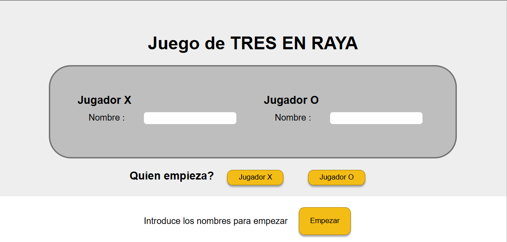
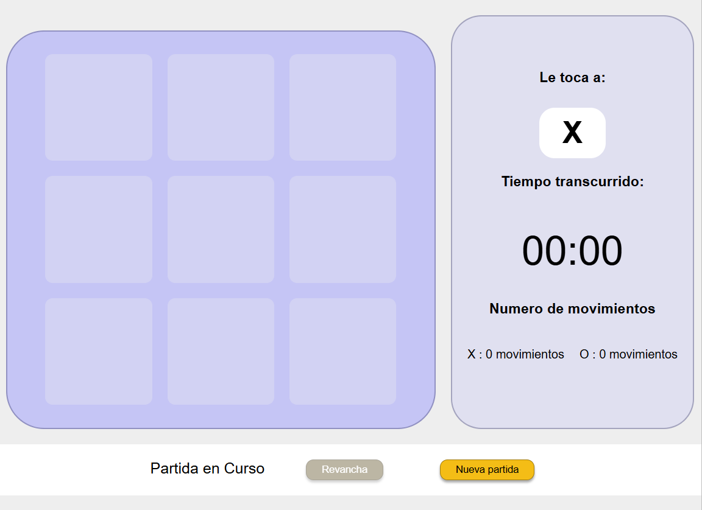
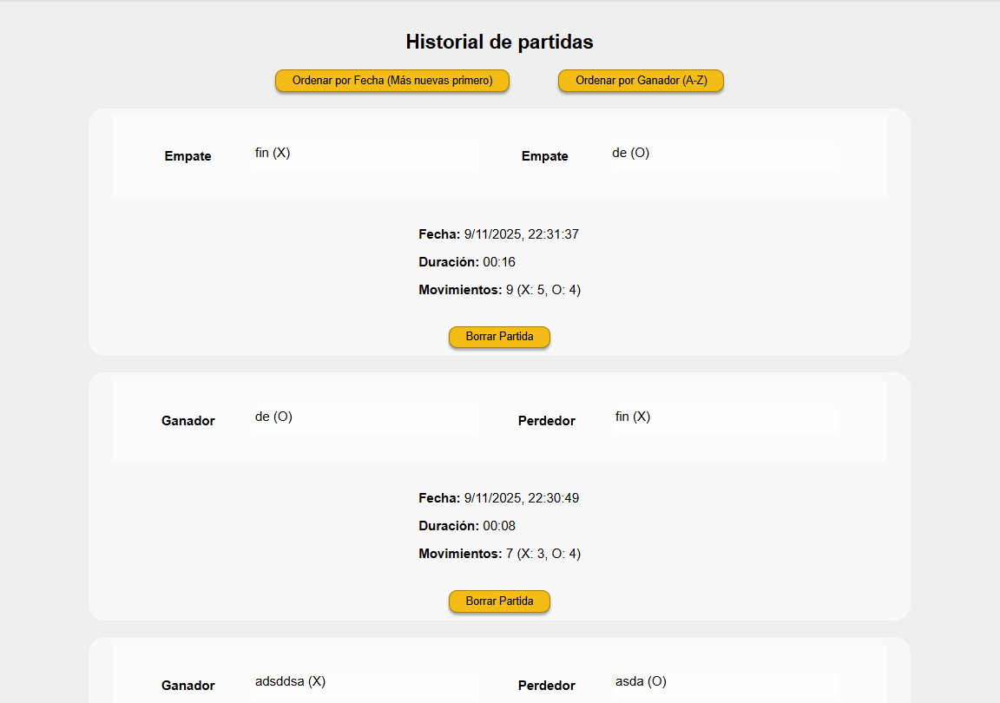
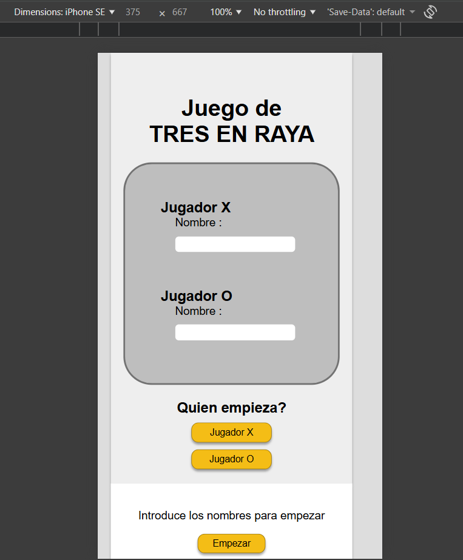
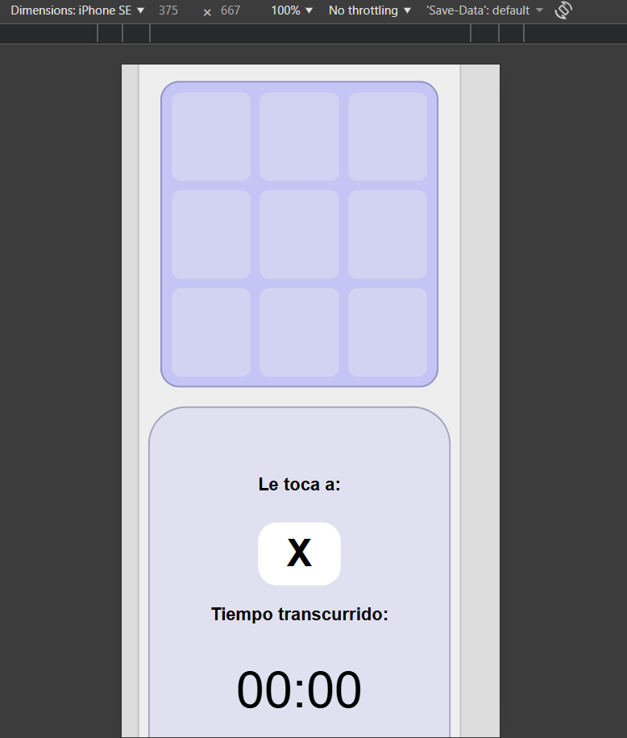
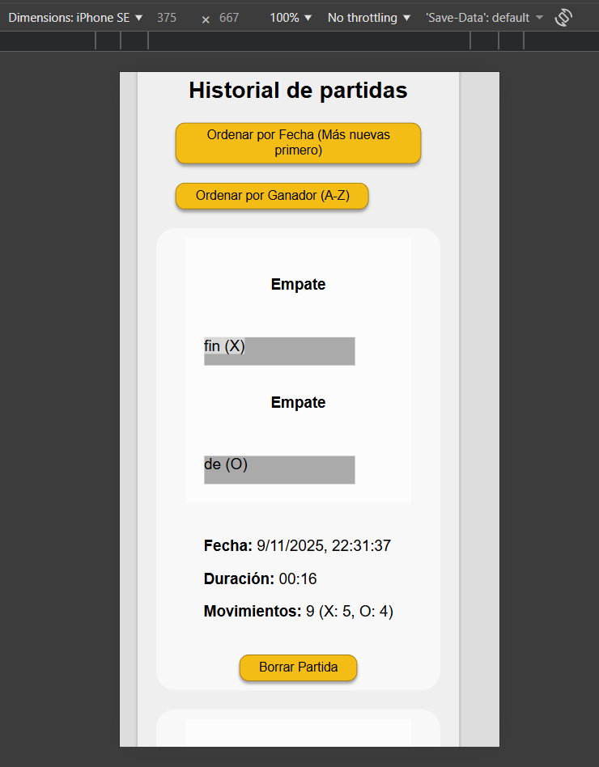
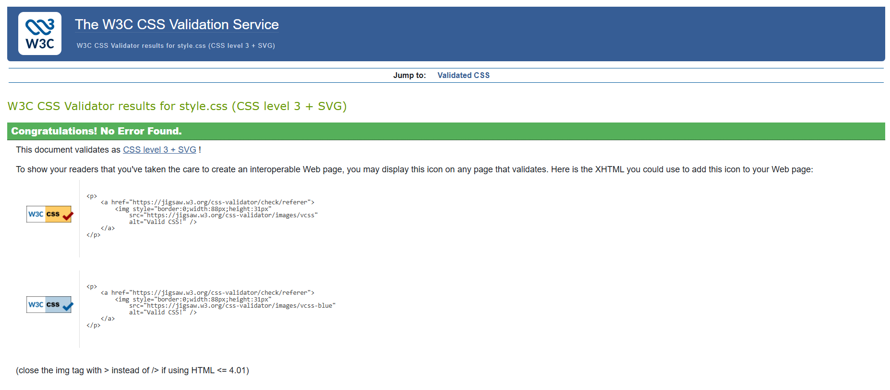
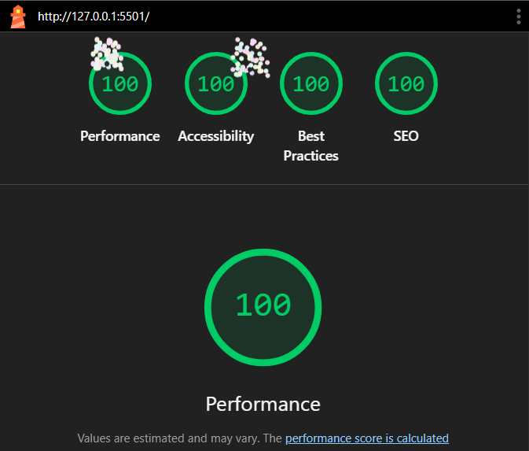

# Juego de TRES EN RAYA
Este es un proyecto realizado para la materia de Plataformas WEB, donde se demuestran los conocimientos adquiridos en clase, en este proyecto aplicaremos los conceptos en `HTML`,`CSS` Y `JavaScript`. En este proyecto hay un enfoque en la manipulacion del `DOM` y el uso de `localStorage` para crear una experiencia de juego persistente.

## Descripcion del juego
Este juego es de tres e raya entre dos jugadores, y antes de empezar una nueva partida debe cumplir con ciertos requisitos:
* -Registro de Jugadores: Los jugadores deben ingresar sus nombres antes de comenzar.
* -Selección de Turno: Se puede elegir qué jugador (X o O) comienza la partida.

En el juego se va a poder ver las estadisticas del juego como:
* -Estadísticas en Vivo: Un cronómetro mide la duración de la partida y un contador registra el número de movimientos de cada jugador.
* -Historial de Partidas: Cada partida completada se guarda automáticamente.
* -Gestion del Historial: El historial muestra los resultados, nombres, tiempo y movimientos. Cada entrada se puede borrar individualmente.
* -Ordenamiento del Historial: El historial se puede ordenar por fecha (más nuevas primero) o por el nombre del ganador (A-Z).
* -Flujo de Juego: Al terminar una partida, los jugadores pueden elegir jugar una "Revancha" (mismos jugadores) o una "Nueva Partida" (pide nuevos nombres).

## Decisiones Técnicas
Para este proyecto, se necesitaba guardar el historial de partidas. Entonces por eso eligi `localStorage` en lugar de opciones más complejas como `IndexedDB`.

Requisitos del Proyecto: Los datos a guardar son simples: un arreglo de objetos de texto. No se necesitan consultas complejas, índices, ni almacenamiento de grandes volúLmenes de datos o archivos (donde `IndexedDB` sería más apropiado).

Adecuación: `localStorage` es perfecto para almacenar una pequeña cantidad de datos estructurados (hasta 5MB-10MB), lo cual es más que suficiente para miles de registros de partidas.

Flujo de como se uso `localStorage`:

Guardar: Se obtiene el arreglo actual con `JSON.parse()`, se añade el nuevo objeto (`.unshift()`) y se vuelve a guardar todo el arreglo con `JSON.stringify()`.

Cargar: Se obtiene el string de `localStorage`, se usa `JSON.parse()` para convertirlo en un arreglo.

Mostrar: Se itera sobre el arreglo (`.forEach()`) y se crea un `div` en el HTML por cada objeto.

Borrar: Se usa el `indice` del arreglo para eliminar el elemento (`.splice(indice, 1)`) y se vuelve a guardar.

Ordenar: Se usa la función nativa `.sort()` del arreglo para reordenarlo según la `fechaISO` o el nombre del ganador, y se vuelve a guardar.

Cada vez que una partida termina, se crea un nuevo objeto con la siguiente estructura y se añade al inicio del arreglo:

### Uso de LocalStorage
Para este proyecto, se necesitaba guardar el historial de partidas. Se eligió `localStorage` en lugar de opciones más complejas como `IndexedDB`, por su simplicidad de uso en este caso.

Simplicidad: El usuario que desarrolla el proyecto está en una etapa de aprendizaje. `localStorage` tiene una API muy simple (solo `setItem`, `getItem`, `removeItem`) que es fácil de entender e implementar.

Requisitos del Proyecto: Los datos a guardar son muy simples: un arreglo de objetos de texto. No se necesitan consultas complejas, índices, ni almacenamiento de grandes volúLmenes de datos o archivos (donde `IndexedDB` sería más apropiado).

Adecuación: `localStorage` es perfecto para almacenar una pequeña cantidad de datos estructurados (hasta 5MB-10MB), lo cual es más que suficiente para miles de registros de partidas.

Este el siguiente flujo:
Guardar: Se obtiene el arreglo actual con `JSON.parse()`, se añade el nuevo objeto (`.unshift()`) y se vuelve a guardar todo el arreglo con `JSON.stringify()`.
Cargar: Se obtiene el string de `localStorage`, se usa `JSON.parse()` para convertirlo en un arreglo.
Mostrar: Se itera sobre el arreglo (`.forEach()`) y se crea un `div` en el HTML por cada objeto.
Borrar: Se usa el `indice` del arreglo para eliminar el elemento (`.splice(indice, 1)`) y se vuelve a guardar.

Ordenar: Se usa la función nativa `.sort()` del arreglo para reordenarlo según la `fechaISO` o el nombre del ganador, y se vuelve a guardar

## Comprobación de Estándares

* **Semántica:** Se utiliza HTML semántico (`<header>`, `<section>`, `<footer>`, `<h2>`, `<label>`) para estructurar el documento de forma clara y lógica.
* **Accesibilidad (Básica):** Se usan etiquetas `<label for="...">` para asociar texto con los inputs. Las celdas del tablero son elementos `<button>`, lo que permite la navegación y activación por teclado. Se usa el atributo `disabled` para controlar el estado de los botones.
* **Diseño Responsivo:** El proyecto incluye una media query básica en el CSS (`@media screen and (max-width:800px)`) que reajusta los componentes principales (formulario, tablero, historial) para una mejor visualización en dispositivos móviles.

## Presentacion Final
### Desde PC

### Desde Movil

## Validacion

